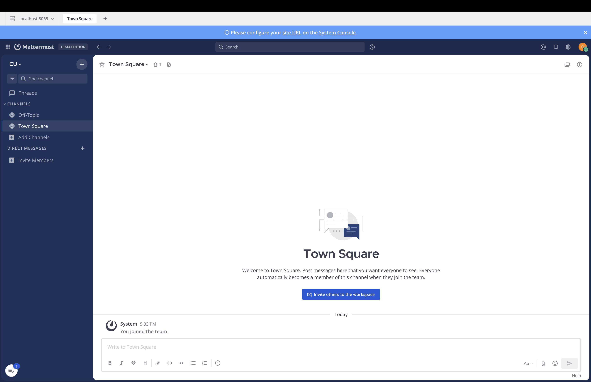

# Mattermost 源码开发环境配置记录

## 1. 作业目标

本次作业目标是按照 Mattermost 官方开发环境文档，完成 Mattermost 源码获取、本地依赖配置、server 启动、浏览器访问和基础登录验证，并记录配置过程中的问题与解决方式。

官方文档阅读地址：

- https://developers.mattermost.com/contribute/developer-setup/
- https://github.com/mattermost/mattermost

阅读时发现，作业资料中提到的 `mattermost-server` 和 `mattermost-webapp` 是旧的拆分仓库背景；当前官方开发文档推荐使用 `mattermost/mattermost` monorepo。

## 2. 本地运行成功截图



截图说明：本地 Mattermost server 已启动，浏览器可访问 `http://localhost:8065`，并完成测试管理员用户登录验证。

## 3. 环境信息

| 项目 | 信息 |
| --- | --- |
| 操作系统 | macOS 26.3.1, arm64 |
| Mattermost 源码路径 | `/Users/mac/Programming/mattermost` |
| Mattermost 仓库 | `https://github.com/mattermost/mattermost` |
| Go | `go version go1.26.3 darwin/arm64` |
| Node.js | `v24.11.1` |
| npm | `11.6.2` |
| nvm | 已配置，使用仓库 `.nvmrc` 指定的 `24.11` |
| PostgreSQL | `psql (PostgreSQL) 18.4 (Homebrew)` |
| 数据库服务 | `postgresql@18 started` |
| 数据库名 | `mattermost_test` |
| 数据库用户 | `mmuser` |
| make | GNU Make 3.81 |
| Docker | 未使用，采用本机 PostgreSQL 路线 |

## 4. 关键命令记录

### 4.1 获取源码

```bash
cd /Users/mac/Programming
git clone https://github.com/mattermost/mattermost.git
```

### 4.2 安装并启动 PostgreSQL

```bash
brew install postgresql@16
brew services start postgresql@18
psql --version
```

由于本机最终运行的 PostgreSQL server 是 18.4，因此将 Homebrew 默认 `psql` 链接切换到 18：

```bash
brew unlink postgresql@16
brew link postgresql@18
psql --version
```

### 4.3 创建 Mattermost 本地开发数据库

进入 PostgreSQL：

```bash
psql postgres
```

创建用户并授予创建数据库权限：

```sql
CREATE ROLE mmuser WITH LOGIN PASSWORD 'mostest';
ALTER ROLE mmuser CREATEDB;
\du
\q
```

使用 `mmuser` 创建数据库：

```bash
psql postgres -U mmuser
```

```sql
CREATE DATABASE mattermost_test;
SELECT datname FROM pg_database WHERE datname = 'mattermost_test';
\q
```

验证连接：

```bash
psql mattermost_test -U mmuser -c "SELECT current_database(), current_user;"
```

输出结果：

```text
 current_database | current_user
------------------+--------------
 mattermost_test  | mmuser
```

### 4.4 配置 Node.js 版本

Mattermost 仓库 `.nvmrc` 要求 Node `24.11`。本机原本 Node 为 `v22.22.3`，因此使用 nvm 安装并切换：

```bash
source ~/.zshrc
cd /Users/mac/Programming/mattermost
nvm install
nvm use
node -v
npm -v
```

验证结果：

```text
v24.11.1
11.6.2
```

### 4.5 配置无 Docker 启动

在 `server/config.override.mk` 中设置：

```makefile
MM_NO_DOCKER = true
```

检查配置是否生效：

```bash
make -C /Users/mac/Programming/mattermost/server -pn | rg '^MM_NO_DOCKER'
```

结果：

```text
MM_NO_DOCKER = true
```

### 4.6 启动 Mattermost server

```bash
cd /Users/mac/Programming/mattermost/server
make run-server
```

验证 server API：

```bash
curl http://localhost:8065/api/v4/system/ping
```

返回：

```json
{"ActiveSearchBackend":"database","AndroidLatestVersion":"","AndroidMinVersion":"","IosLatestVersion":"","IosMinVersion":"","status":"OK"}
```

### 4.7 构建 webapp 前端资源

首次访问 `http://localhost:8065` 时发现缺少前端构建产物，因此执行：

```bash
cd /Users/mac/Programming/mattermost
nvm use
cd webapp
make dist
```

构建完成后生成：

```text
/Users/mac/Programming/mattermost/webapp/channels/dist/root.html
/Users/mac/Programming/mattermost/server/client/root.html
```

### 4.8 创建测试管理员用户

```bash
cd /Users/mac/Programming/mattermost/server
bin/mmctl user create --local \
  --email tideadmin@example.com \
  --username tideadmin \
  --password TideAdmin123 \
  --system-admin
```

返回：

```text
Created user tideadmin
```

使用 API 验证登录：

```bash
curl -sS -o /tmp/mattermost-login-check.json -w '%{http_code}\n' \
  -H 'Content-Type: application/json' \
  -d '{"login_id":"tideadmin","password":"TideAdmin123"}' \
  http://localhost:8065/api/v4/users/login
```

返回：

```text
200
```

## 5. 报错记录与解决方案

### 问题 1：PostgreSQL 服务未启动

运行：

```bash
psql postgress
```

报错：

```text
psql: error: connection to server on socket "/tmp/.s.PGSQL.5432" failed: No such file or directory
Is the server running locally and accepting connections on that socket?
```

原因分析：

- `psql` 客户端已安装，但 PostgreSQL 后台服务未启动；
- 同时数据库名拼写错误，应为 `postgres`，不是 `postgress`。

解决方式：

```bash
brew services start postgresql@18
psql postgres
```

### 问题 2：SQL 语句漏写分号

输入：

```sql
CREATE ROLE mmuser WITH LOGIN PASSWORD 'mostest'
```

提示符变为：

```text
postgres-#
```

原因分析：

`psql` 中普通 SQL 语句需要以分号 `;` 结束。提示符从 `postgres=#` 变成 `postgres-#` 表示上一条 SQL 尚未结束。

解决方式：

```sql
;
```

随后返回：

```text
CREATE ROLE
```

### 问题 3：psql 客户端和 PostgreSQL server 版本不一致

现象：

```text
psql (16.14 (Homebrew), server 18.4 (Homebrew))
WARNING: psql major version 16, server major version 18.
```

执行 `\l` 报错：

```text
ERROR: column d.daticulocale does not exist
HINT: Perhaps you meant to reference the column "d.datlocale".
```

原因分析：

本机同时安装了 `postgresql@16` 和 `postgresql@18`，数据库服务运行的是 18.4，但 `/opt/homebrew/bin/psql` 链接到 16.14。`\l` 是 psql 客户端内部命令，客户端和服务端主版本不一致导致查询系统字段不兼容。

解决方式：

```bash
brew unlink postgresql@16
brew link postgresql@18
psql --version
```

验证结果：

```text
psql (PostgreSQL) 18.4 (Homebrew)
```

### 问题 4：Node.js 版本不匹配

现象：

```text
Node 要求：24.11
本机：v22.22.3
nvm：当前终端不可用
```

原因分析：

本机已有 `~/.nvm`，但 `.zshrc` 未加载 nvm，导致当前终端继续使用旧版本 Node。

解决方式：

在 `~/.zshrc` 中添加：

```bash
export NVM_DIR="$HOME/.nvm"
[ -s "$NVM_DIR/nvm.sh" ] && \. "$NVM_DIR/nvm.sh"
[ -s "$NVM_DIR/bash_completion" ] && \. "$NVM_DIR/bash_completion"
```

然后运行：

```bash
source ~/.zshrc
cd /Users/mac/Programming/mattermost
nvm install
nvm use
```

验证：

```text
node v24.11.1
npm 11.6.2
```

### 问题 5：浏览器访问 localhost:8065 时提示 root.html 不存在

报错：

```text
open /Users/mac/Programming/mattermost/server/client/root.html: no such file or directory
```

原因分析：

Mattermost server 后端已启动，`/api/v4/system/ping` 也返回 `status: OK`，但浏览器访问首页需要前端静态资源。`server/client` 是指向 `webapp/channels/dist` 的软链接，当时 webapp 尚未构建，因此缺少 `root.html`。

解决方式：

```bash
cd /Users/mac/Programming/mattermost
nvm use
cd webapp
make dist
```

验证：

```bash
ls -lh /Users/mac/Programming/mattermost/server/client/root.html
curl -I http://localhost:8065
```

结果：

```text
HTTP/1.1 200 OK
Content-Type: text/html
```

### 问题 6：创建 admin 用户时用户名已存在

命令：

```bash
bin/mmctl user create --local --email admin@example.com --username admin --password Admin12345 --system-admin
```

报错：

```text
Error: Unable to create user. Error: An account with that username already exists.
```

原因分析：

数据库中已有同名 `admin` 用户。

解决方式：

改用新用户名：

```bash
bin/mmctl user create --local \
  --email tideadmin@example.com \
  --username tideadmin \
  --password TideAdmin123 \
  --system-admin
```

结果：

```text
Created user tideadmin
```

## 6. Mattermost 目录结构理解

当前 Mattermost 使用 monorepo 结构，核心目录如下：

```text
mattermost/
├── server/      后端服务，主要使用 Go
├── webapp/      前端应用，主要使用 React + TypeScript
├── api/         API 相关内容
├── e2e-tests/   端到端测试
└── tools/       工具脚本
```

### server 侧关键目录

新版源码中，作业要求提到的 `api4/`、`app/`、`store/` 位于 `server/channels/` 下：

```text
server/channels/api4/
server/channels/app/
server/channels/store/
server/public/model/
```

理解如下：

| 目录 | 用途 |
| --- | --- |
| `server/channels/api4/` | HTTP API v4 入口，负责接收 webapp、Bot、外部系统的请求 |
| `server/channels/app/` | 核心业务逻辑，例如用户、频道、消息、权限、Slash Command 等 |
| `server/channels/store/` | 数据访问层，负责和 PostgreSQL 交互 |
| `server/public/model/` | 公共数据模型，例如 User、Channel、Post 等结构 |
| `server/cmd/` | 命令行入口，包括 Mattermost server 和相关 CLI |
| `server/config/` | 配置加载、解析、数据库配置等逻辑 |
| `server/tests/` | 测试配置和测试辅助内容 |

一次发送消息的大致流程可以理解为：

```text
webapp 用户点击发送
→ server/channels/api4 接收 HTTP 请求
→ server/channels/app 检查权限并处理业务逻辑
→ server/channels/store 写入 PostgreSQL
→ server 通过 WebSocket 推送给其他在线用户
```

### webapp 侧关键目录

前端核心代码位于：

```text
webapp/channels/src/
```

常见目录：

| 目录 | 用途 |
| --- | --- |
| `components/` | React 页面组件 |
| `actions/` | 前端动作和请求触发 |
| `client/` | 和 Mattermost server API 通信的客户端逻辑 |
| `reducers/` | 前端状态更新 |
| `selectors/` | 从状态中读取派生数据 |
| `utils/` | 工具函数 |
| `i18n/` | 国际化文本 |

`webapp/channels/dist/` 是前端构建产物目录，server 通过 `server/client` 软链接读取这里的静态资源。

## 7. 总结

本次作业完成了 Mattermost 源码获取、本机 PostgreSQL 配置、Go/Node.js 环境校准、无 Docker server 启动、webapp 构建、浏览器访问和测试管理员登录验证。

过程中遇到了 PostgreSQL 服务未启动、数据库命令分号遗漏、psql/server 版本不一致、Node.js 版本不匹配、前端静态资源未构建、用户名重复等问题，并逐步完成定位和解决。
